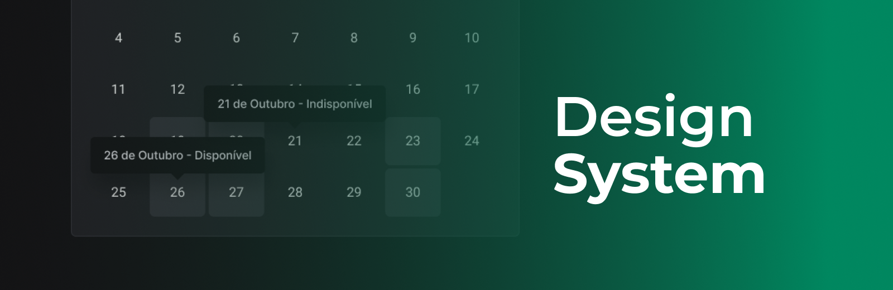

# Design System - Ignite Call

<h1 align="center">
    
</h1>

<br>

### 💻 Design System - Ignite Call

Assemble a visual structure of a design system in practice with Figma and how to port it to code, thus making data available for component testing via StoryBook, automated deployment with GitHub Actions and Front-End simulation in Vite.

What was developed:

- Styling with Tailwind;
- MonoRepo;
- Radix Ui for highly accessible components;
- Creation of custom tokens in the design system using TailwindCSS;
- Components, Props and Variants;
- Implementation of the composition design pattern in React (Compound Component);
- Documentation of components and their variants in Storybook;
- CI/CD: configuration of Storybook deployment through a Github Actions workflow for Github Pages;
- Using storybook-addon-a11y to test components against web accessibility standards;
- File system structure of the project separated by folder;  
<br />

## Packages structure
- Tokens
Published on npm
Objective of abstracting sizes, fonts, colors, etc. To help with styling.
&nbsp;

- React
Published on npm
React components to use in project development.
&nbsp;

- eslint-config
Eslint configurations to assist in package development
&nbsp;

- ts-config
Typescript configurations to assist in package development
&nbsp;

- docs
Project documentation, Contains all tokens and components that will be used in the project
Powered by StoryBook


## 🧪 Tools

Application developed using the following tools:

- ReactJS(Vite)
- Typescript
- Storybook
- Radix UI
- Tailwind CSS
- Storybook
- Github Actions
- TuboRepo
- MonoRepo
- Phosphor Icons
  
  <br />
  
- [Design Figma - Design System](https://www.figma.com/file/cowwFHJimoyQomSAynMjGz/Ignite-Call?node-id=4%3A412)

## Design System screens:
 

 <br />

### Programs needed to Getting started

- [NodeJS](https://nodejs.org/en/)
- [Visual Studio Code - Vscode](https://code.visualstudio.com/)
- [Git](https://git-scm.com/)

Clone the project and access the folder

```bash
  # Clone this repository
  $ git clone https://github.com/felipe-gomes-vicente/design-system-challenge.git

  # Access the project folder in your terminal
  $ cd design-system-challenge

  # Install the dependencies
  $ npm install

  # Run the application in development mode
  $ npm run dev

  # The application will open on the port: 5173 - go to http://localhost:5173/ or http://127.0.0.1:5173/ 
```

## 📝 License

This project is under the MIT license. See the file [LICENSE](LICENSE) for more details.

---

&nbsp;

<p align="center">Done with 💜 by Felipe Vicente👋</p>

- ## My LinkedIn - [](https://www.linkedin.com/in/felipe-gomes-vicente/)